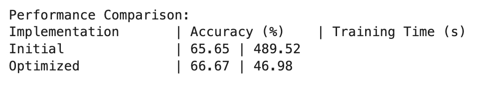
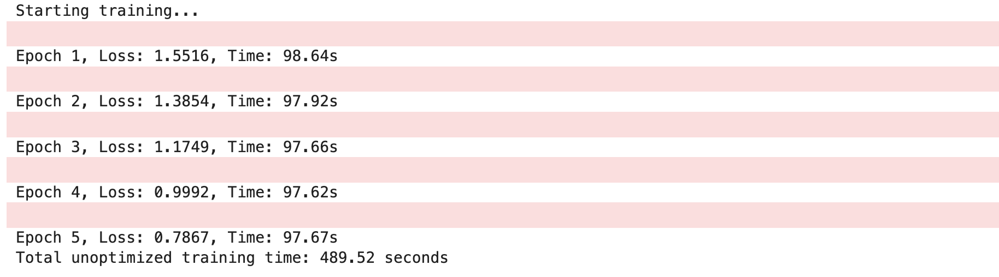
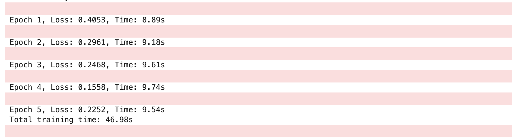

# Training ResNet10 on CIFAR10: Unoptimized vs Optimized

This project demonstrates two training approaches for a ResNet10 model on the CIFAR10 dataset:
- **Unoptimized Training:** A baseline approach.
- **Optimized Training:** An enhanced version that leverages multiple modern techniques to speed up training by roughly 10x while maintaining (or even improving) accuracy.

---

## Overview

The code is divided into two main sections:

1. **Unoptimized Training:**  
   - **Model Definition:** Implements a ResNet10 model with basic convolutional layers, batch normalization, and residual connections.
   - **Training Loop:** Uses a very small batch size (e.g., 4) with a simple SGD optimizer. The training loop performs standard forward and backward passes and evaluates the model on the CIFAR10 test set.
   - **Purpose:** Establish a performance and accuracy baseline without any advanced optimizations.

2. **Optimized Training:**  
   - **Data Loading Optimizations:**  
     - Uses a larger batch size (e.g., 256) to increase GPU utilization.
     - Implements multiple worker threads and pinned memory for faster data transfer from CPU to GPU.
   - **Mixed Precision Training:**  
     - Utilizes PyTorch’s `autocast` for faster computations on supported hardware.
     - Applies `GradScaler` to ensure stable training with lower precision.
   - **Gradient Accumulation:**  
     - Simulates a larger batch size by accumulating gradients over several iterations before updating the weights.
   - **Modern Optimizer & Scheduler:**  
     - Switches from SGD to AdamW for improved convergence.
     - Uses a OneCycleLR learning rate scheduler to dynamically adjust the learning rate during training.
   - **Weight Sharing:**  
     - Shares weights in one of the early layers of the network to reduce redundancy and computation.
   - **Purpose:** Dramatically reduce training time and improve convergence without sacrificing accuracy.

---

## Results

After training for 5 epochs, the performance of both methods is compared in terms of accuracy and training time. Here is a sample comparison table (replace the placeholders with your actual results):

---

## Screenshots & Logs

### Unoptimized Training Logs

### Optimized Training Logs

---

## Kaggle Notebook

For an interactive demonstration of this project, check out my [Kaggle Notebook](https://www.kaggle.com/code/faizal0337/s28-towards-optimization-of-resnet10-for-cifar10).

---

## Conclusion

This project shows that by incorporating modern training techniques such as mixed precision, gradient accumulation, and advanced optimization strategies, you can significantly speed up the training process of deep learning models without compromising on performance. These strategies can be beneficial in both research and production settings where training efficiency is critical.

Happy Training!
